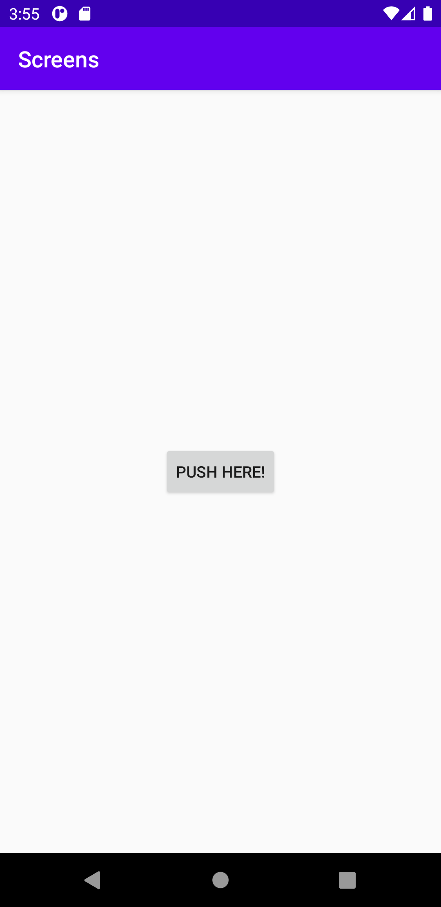
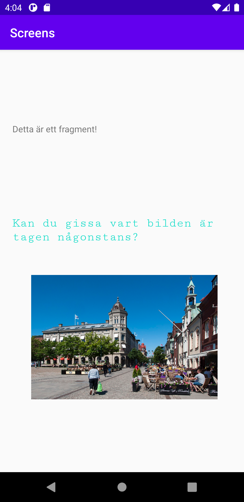

# Rapport

Assignment 4 - Screens

 Först forkade skolans ”Screens” från Github.

 Sedan lades en till aktivitet in (second activity), som fick namnet ”activity_login2”.
 Då fick man två nya filer som heter LoginActivity2.java och activity_login2.xml.

```
@Override
protected void onCreate(Bundle savedInstanceState) {
    super.onCreate(savedInstanceState);
    setContentView(R.layout.activity_login2);
 ```

I xml filen skapades en knapp som sedan skulle öppna så att man fick upp den nya aktiviteten.

För att göra så att den ny andra aktiviteten skulle öppnas först behövde man koda det i ”AndroidManifest.XML”,
som man kan säga ”berättar för programmet vilken fil som ska öppnas först”. Det man gjorde var att ändra från ordningen
då LoginActivity2 tagen ska ligga före MainActivity. Man var sedan tvungen att ta bort det som fanns innanför MainActivity
för man ville inte att det skulle referera till något annat.


```
 <activity android:name=".LoginActivity2">
     <intent-filter>
         <action android:name="android.intent.action.MAIN" />

         <category android:name="android.intent.category.LAUNCHER" />
     </intent-filter>
 </activity>
 <activity android:name=".MainActivity">
<!-- gjorde så att min login är den första som syndes -->
 </activity>
 ```

Knappen lades in Login2.XML

```
<Button
    android:id="@+id/button1_login"
    android:layout_width="wrap_content"
    android:layout_height="wrap_content"
    android:text="Push here!”
 ```


 För att den skulle fungera behöver man koda lite i LoginActivity2.java. För att kolla om knappen
 fungerar kan man använda Lof.d( tag””, msg””) och sedan trycka på ”Logcat” för att få upp det man har skrivit in.

```
Button button = findViewById(R.id. button1_login);
button.setOnClickListener(new View.OnClickListener() {
    @Override
    public void onClick(View v) {
        Log.d("TAG","Startar aktivitet”);
 ```


 En intent skapades för att kunna ta oss från LoginActivity2.this och sedan kunna ta oss vidare till MainActivity.class.

```
Intent intent = new Intent(LoginActivity2.this, MainActivity.class);
startActivity(intent);
```


Nästa steg var att skapa en fragment i den nya aktiviteten.  Det gjorde man inuti Android Studio.
Då fick man flera olika filer som, BlankFragment.java och fragment_blank.xml.
Sedan måste man lägga in en fragment tagg i activity_main.

```
<fragment
    android:name="com.example.screens.BlankFragment"
    android:layout_width="match_parent"
    android:layout_height="150dp"
    android:layout_marginLeft="20dp"
    android:tag="blank_fragment"/>
```

I detta fall var man även tvungen att skapa en <LinerLayout tagg runt alla taggar som fanns.

```
<LinearLayout
    android:layout_width="wrap_content"
    android:layout_height="wrap_content"
    android:orientation="vertical"
    app:layout_constraintBottom_toBottomOf="parent"
    app:layout_constraintLeft_toLeftOf="parent"
    app:layout_constraintRight_toRightOf="parent"
    app:layout_constraintTop_toTopOf="parent">

 ```

Sedan skulle man skapa en till ”Widget”, i detta fall skapades en <imageView>, en bild som lades in,
genom margin och width och height kunde man style den.

```
<ImageView
    android:id="@+id/imageView"
    android:layout_width="300dp"
    android:layout_height="200dp"
    android:contentDescription="Skovde town "
    android:layout_marginLeft="50dp"
    android:layout_marginTop="50dp"
    app:srcCompat="@drawable/skovde" />
```





